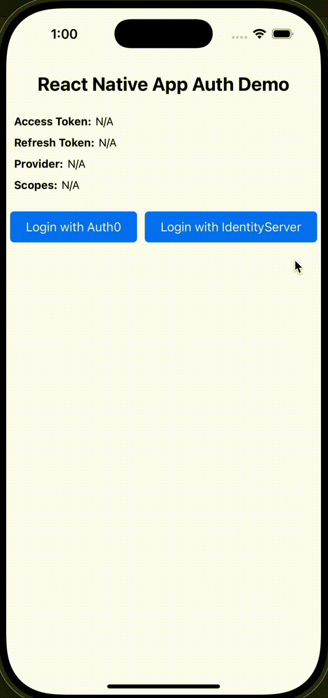

# React Native App Auth Example



The demo is a Yarn workspace. Install dependencies from the repository root with
Yarn 1.22.22; the root `yarn.lock` also resolves the local library for the demo.

## Running the iOS app

After cloning the repository, run the following:

```sh
cd react-native-app-auth
yarn install --frozen-lockfile
cd examples/demo
(cd ios && pod install)
npx react-native run-ios
```

## Running the Android app

After cloning the repository, run the following:

```sh
cd react-native-app-auth
yarn install --frozen-lockfile
cd examples/demo
npx react-native run-android
```

### Notes

The demo uses React Native 0.87, Node 22.13+, iOS 15.1+, and Android API 24+.
Start Metro with `yarn start` if running the native projects directly. To use another port, pass the same `--port <port>` to Metro and the run command.

From the repository root, run the native regression suites locally against booted devices. They require no provider credentials or Metro server:

```sh
yarn workspace react-native-app-auth test:ios-presenter <simulator-udid>
yarn workspace react-native-app-auth test:android-recovery <emulator-serial>
```

The Android suite uses a loopback token endpoint and does not require Metro or OAuth credentials.

* You have to have the emulator open before running the last command. If you have difficulty getting the emulator to connect, open the project from Android Studio and run it through there.
* ANDROID: When integrating with a project that utilizes deep linking (e.g. [React Navigation deep linking](https://reactnavigation.org/docs/deep-linking/#set-up-with-bare-react-native-projects)), update the redirectUrl in your config and the `appAuthRedirectScheme` value in build.gradle to use a custom scheme so that it differs from the scheme used in your deep linking intent-filter [as seen here](https://github.com/FormidableLabs/react-native-app-auth/issues/494#issuecomment-797394994).

Example:
```
// build.gradle
android {
  defaultConfig {
    manifestPlaceholders = [
      appAuthRedirectScheme: 'io.identityserver.demo.auth'
    ]
  }
}
```
